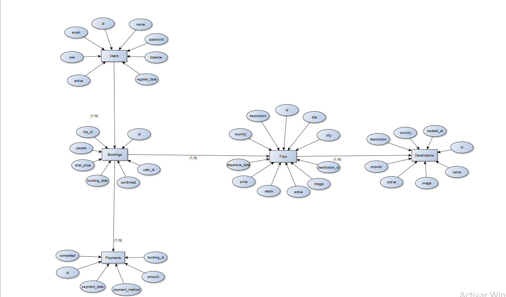

# ✈️ TravelBooking - Proyecto DAM

## 📌 Descripción

TravelBooking es una aplicación web desarrollada en Java que permite gestionar reservas de viajes turísticos.

La aplicación permite:

- Gestión de usuarios
- Gestión de viajes
- Reservas de viajes
- Control de plazas disponibles

El proyecto sigue una arquitectura basada en:

```text
Modelo → DAO → Servlet → JSP
```

y utiliza MariaDB como base de datos relacional.

---

# 🎯 Objetivos del proyecto

- Aplicar modelado de bases de datos
- Implementar relaciones entre entidades
- Desarrollar operaciones CRUD completas
- Aplicar arquitectura DAO
- Gestionar usuarios y reservas
- Aplicar lógica de negocio real
- Crear una aplicación web funcional

---

# 🛠️ Tecnologías utilizadas

- Java
- JSP
- Servlets
- Maven
- MariaDB
- JDBI
- Bootstrap 5
- Apache Tomcat
- IntelliJ IDEA

---

# 🧩 Funcionalidades

## 👤 Usuarios

- Registro de usuarios
- Inicio de sesión
- Roles ADMIN / USER
- Gestión de saldo
- Activación/desactivación de usuarios

---

## ✈️ Trips

- Alta de viajes
- Edición de viajes
- Eliminación de viajes
- Gestión de plazas
- Fecha de salida
- Imagen del viaje
- Asociación a destinos

---

## 📅 Bookings

- Creación de reservas
- Cálculo automático del precio total
- Uso automático de la fecha del viaje
- Reserva asociada al usuario logueado
- Descuento automático de plazas
- Desactivación automática de viajes agotados

---

# 🗄️ Modelo Relacional

```text
users [PK id, name, email, password, role, balance, active, register_date]

destinations [PK id, name, description, country, image, popular, active, created_at]

trips [PK id, title, description, country, city, price, seats, departure_date, active, image, FK destination_id]

bookings [PK id, people, total_price, booking_date, confirmed, FK user_id, FK trip_id]

payments [PK id, amount, payment_method, payment_date, completed, FK booking_id]
```

---

# 🔗 Relaciones

## 👤 Users ↔ Bookings

```text
Users (1) ←→ (N) Bookings
```

- Un usuario puede realizar muchas reservas
- Cada reserva pertenece a un único usuario

---

## ✈️ Trips ↔ Bookings

```text
Trips (1) ←→ (N) Bookings
```

- Un viaje puede tener muchas reservas
- Cada reserva pertenece a un único viaje

---

## 🌍 Destinations ↔ Trips

```text
Destinations (1) ←→ (N) Trips
```

- Un destino puede tener muchos viajes
- Cada viaje pertenece a un único destino

---

## 💳 Bookings ↔ Payments

```text
Bookings (1) ←→ (N) Payments
```

- Una reserva puede tener varios pagos
- Cada pago pertenece a una única reserva

---

# 🧠 Modelo Entidad Relación

## 📷 Diagrama ER



---

# 📁 Estructura del proyecto

```text
src
 ├── main
 │    ├── java
 │    │     ├── dao
 │    │     ├── model
 │    │     ├── servlet
 │    │
 │    ├── webapp
 │          ├── includes
 │          ├── images
 │          ├── *.jsp
```

---

# 🧱 Arquitectura utilizada

## 📌 Modelo

Clases Java que representan las entidades:

- User
- Trip
- Booking
- Destination
- Payment

---

## 📌 DAO

Acceso a base de datos usando JDBI.

Ejemplos:
- UserDao
- TripDao
- BookingDao

---

## 📌 Servlets

Controladores encargados de procesar las peticiones HTTP.

Ejemplos:
- addBooking
- addTrip
- deleteBooking
- updateTrip

---

## 📌 JSP

Interfaz visual de la aplicación.

Ejemplos:
- bookings.jsp
- trips.jsp
- createBooking.jsp
- bookingDetail.jsp

---

# ⚙️ Base de datos

Motor utilizado:

```text
MariaDB
```

Conexión realizada mediante:

```text
JDBI + JDBC
```

---

# 🚀 Funcionalidades destacadas

## ✔️ Cálculo automático de reservas

El sistema calcula automáticamente:

- precio total
- plazas restantes
- activación/desactivación de viajes

---

## ✔️ Gestión automática de plazas

Cuando un usuario realiza una reserva:

- se descuentan plazas
- si no quedan plazas:
  - el viaje se desactiva automáticamente

---

## ✔️ Gestión de roles

Existen dos roles:

```text
ADMIN
USER
```

Los administradores pueden:
- editar
- eliminar
- gestionar entidades

---

# ▶️ Puesta en marcha del proyecto

## 📌 Requisitos

Antes de ejecutar el proyecto es necesario tener instalado:

- Java JDK 21+
- Apache Maven
- Apache Tomcat
- MariaDB
- IntelliJ IDEA

---

# ⚙️ Configuración de la base de datos

Crear una base de datos en MariaDB:

```sql
CREATE DATABASE travelbooking;
```

Configurar las credenciales en:

```text
Database.java
```

---

# 🚀 Ejecutar el proyecto

Abrir una terminal en la raíz del proyecto y ejecutar:

```bash
mvn tomcat7:redeploy
```

---

# 🌐 Acceso a la aplicación

Una vez desplegado:

```text
http://localhost:8080/TravelBooking
```

o el puerto configurado en Tomcat.

---

# ✅ Compilar el proyecto

```bash
mvn clean package
```

---

# 🎨 Diseño

La interfaz utiliza:

```text
Bootstrap 5
```

para crear una interfaz moderna y responsive.

---

# 📌 Autor

## 👨‍💻 ADRIAN GABAS / GEMMA FERNANDEZ / PETER ESMARITO

Proyecto desarrollado para:

```text
DAM - Desarrollo de Aplicaciones Multiplataforma
```

---

# ✅ Estado del proyecto

```text
Proyecto funcional y operativo
```

Incluye:
- CRUD completo
- Relaciones entre entidades
- Gestión de reservas
- Sistema de usuarios
- Persistencia en base de datos
- Arquitectura MVC simplificada con DAO + Servlets + JSP
